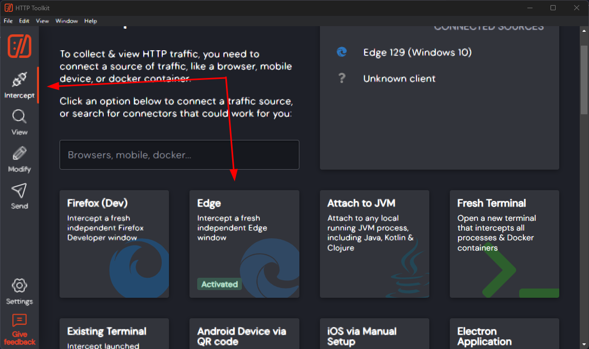
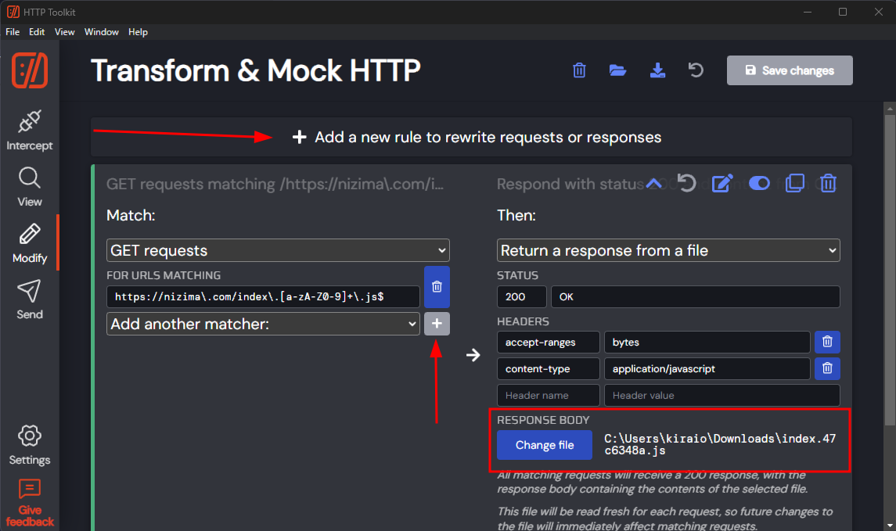
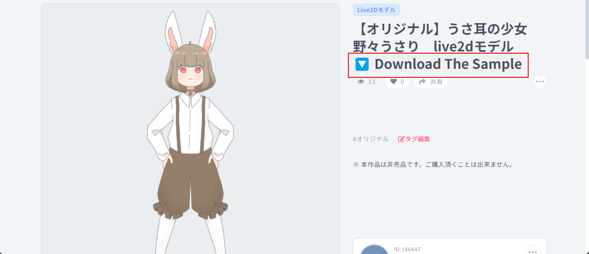
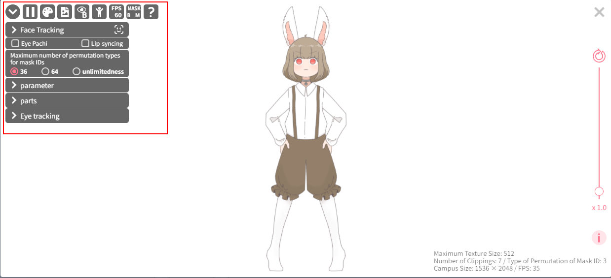
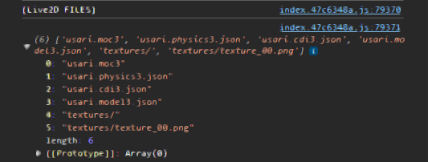
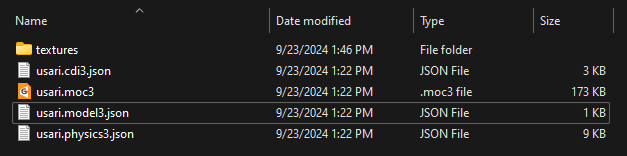
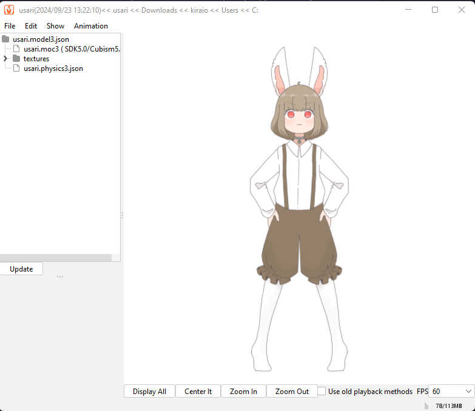

<div align="center">
    <a href="https://nizima.com">
        
    </a>
    <h1>Dump <a href="https://nizima.com" title="Nizima">Nizima</a> Live2D</h1>
</div>

## Prerequisite

- [HTTP Toolkit](https://httptoolkit.com/ "HTTP Toolkit")
- Browser
- [httptoolkit-pro-patcher](https://github.com/XielQs/httptoolkit-pro-patcher "httptoolkit-pro-patcher") (Optional)

## How To

- Go to <https://nizima.com> page and open Developer Tools.
- Download `index.47c6348a.js`. Quick download: <https://nizima.com/index.47c6348a.js>
- Open the JS file in your favorite IDE and format with your favorite formatter, like Prettier.
- Find `class k0`:

  ```js
  class k0 {
    constructor(e) {
        this.buffer = e,
        this._password = "LrND6UfK(j-NmN7tTb+2S&6J56rEdfHJ3+pA",
        this.files = void 0
    }
    initAsync(e) {
        return kQ(this, void 0, void 0, function*() {
            let t = new kT(new kd(new Uint8Array(this.buffer)))
              , n = yield t.getEntries({
                filenameEncoding: "shift-jis"
            });
            yield t.close(),
            null == e || e({
                type: "initialized",
                fileSize: n.length
            });
            let r = 0;
            this.files = yield Promise.all(n.map(t => kQ(this, void 0, void 0, function*() {
                if (void 0 === t.getData)
                    return {
                        entry: t,
                        data: new Uint8Array(0)
                    };
                let n = yield t.getData(new kp, {
                    password: t.encrypted ? this._password : void 0
                });
                return null == e || e({
                    type: "file-loaded",
                    numLoaded: r++
                }),
                {
                    entry: t,
                    data: n
                }
            })))
        })
    }
    get filenames() {
        if (void 0 === this.files)
            throw Error("初期化してください。");
        return this.files.map(e => e.entry.filename)
    }
    loadAsArrayBufferAsync(e) {
        return kQ(this, void 0, void 0, function*() {
            if (void 0 === this.files)
                throw Error("初期化してください。");
            if (!e)
                throw Error("ファイルを指定してください。");
            let t = e.match(/^\.+\/(.*)/);
            t && t.length > 1 && ([,e] = t);
            let n = this.files.find(t => t.entry.filename === e);
            return void 0 === n ? new ArrayBuffer(0) : n.data.buffer.slice(0)
        })
    }
    loadAsJsonAsync(e) {
        return kQ(this, void 0, void 0, function*() {
            let t = new Uint8Array((yield this.loadAsArrayBufferAsync(e)))
              , n = [];
            t.forEach(e => n.push(e));
            let r = "";
            for (let e = 0; e < t.length; e += 1024)
                r += String.fromCharCode.apply(null, n.slice(e, e + 1024));
            return JSON.parse(decodeURIComponent(escape(r).replace(/%00/g, "")))
        })
    }
  }
  ```

- Modify the class to this and save!

  ```js
  class k0 {
    constructor(e) {
        this.buffer = e,
        this._password = "LrND6UfK(j-NmN7tTb+2S&6J56rEdfHJ3+pA",
        this.files = void 0
    }
    initAsync(e) {
        return kQ(this, void 0, void 0, function*() {
            let t = new kT(new kd(new Uint8Array(this.buffer)))
              , n = yield t.getEntries({
                filenameEncoding: "shift-jis"
            });
            yield t.close(),
            null == e || e({
                type: "initialized",
                fileSize: n.length
            });
            let r = 0;
            this.files = yield Promise.all(n.map(t => kQ(this, void 0, void 0, function*() {
                if (void 0 === t.getData)
                    return {
                        entry: t,
                        data: new Uint8Array(0)
                    };
                let n = yield t.getData(new kp, {
                    password: t.encrypted ? this._password : void 0
                });
                return null == e || e({
                    type: "file-loaded",
                    numLoaded: r++
                }),
                {
                    entry: t,
                    data: n
                }
            })))

            // Create the download button
            if (!document.querySelector('.download') && document.querySelector('#itemName'))
            {
                const overlay = document.querySelector("#itemName");
                this.downloadButton = document.createElement("button");
                this.downloadButton.setAttribute("class", "download");
                this.downloadButton.innerText = "🔽 Download The Sample";
                overlay.appendChild(this.downloadButton);
            
                // Attach event listener to the button
                this.downloadButton.addEventListener("click", () => this.downloadAllFiles(this.files));
            }
        })
    }
    // Download files from a list
    downloadAllFiles(live2dFiles) {
        if (!live2dFiles || live2dFiles.length === 0) {
            alert("No files to download. Please initialize first.");
            return;
        }

        live2dFiles.forEach((file) => {
            this.downloadFile(file.entry.filename, file.data);
        });
    }
    // Download individual file
    downloadFile(filename, fileData) {
        if (filename.endsWith("/"))
            return;

        console.log(`Downloading ${filename}...`);
        let blob = new Blob([fileData], { type: 'application/octet-stream' });
        let link = document.createElement("a");
        let url = window.URL.createObjectURL(blob);
        link.href = url;
        link.download = filename;
        document.body.appendChild(link);
        link.click();
        document.body.removeChild(link);
        window.URL.revokeObjectURL(url);
    }
    get filenames() {
        if (void 0 === this.files) throw Error("初期化してください。");
        let name = this.files.map((e) => e.entry.filename);
        // Log all files name that's possible to download
        console.log('[Live2D FILES]');
        console.log(name);
        return name;
    }
    loadAsArrayBufferAsync(e) {
        return kQ(this, void 0, void 0, function*() {
            if (void 0 === this.files)
                throw Error("初期化してください。");
            if (!e)
                throw Error("ファイルを指定してください。");
            let t = e.match(/^\.+\/(.*)/);
            t && t.length > 1 && ([,e] = t);
            let n = this.files.find(t => t.entry.filename === e);
            return void 0 === n ? new ArrayBuffer(0) : n.data.buffer.slice(0)
        })
    }
    loadAsJsonAsync(e) {
        return kQ(this, void 0, void 0, function*() {
            let t = new Uint8Array((yield this.loadAsArrayBufferAsync(e)))
              , n = [];
            t.forEach(e => n.push(e));
            let r = "";
            for (let e = 0; e < t.length; e += 1024)
                r += String.fromCharCode.apply(null, n.slice(e, e + 1024));
            return JSON.parse(decodeURIComponent(escape(r).replace(/%00/g, "")))
        })
    }
  }
  ```

- Open HTTP Toolkit. In the `Intercept` tab, select your target browser. Mine is Edge.

  

- Go to `Modify` tab. Add a new rule.
  - Match: Get requests
  - Add another matcher > For URLs matching:

    ```txt
    https://nizima\.com/index\.[a-zA-Z0-9]+\.js$
    ```

  - Click the blue ➕ button. (Make sure you do this! Otherwise, it will not be saved.)
  - Match other settings like in the image below and change the response body with the modified JS file earlier.
  - Save changes.

    

- Now, go to any item you want in Nizima and you will see the download button right next to item name.

  

- Before you downloading the sample, click the Live2D preview and play with the settings to trigger the assets caching.

  

- You can download the sample now. Keep it in mind, not all the sample files can be downloaded. Sometimes they're not cached or only portion of the samples is served by the server.  
  See the Developer Console.

  

- Rename or move the downloaded files to match with the files structure in the Dev Console.

  

- You can now open it with Cubism Viewer (for OW).

  

## Contribute

Upload your dumped Live2D in <https://github.com/bungaku-moe/Nizima-Live2D-Samples> with the item ID (you can see it in the URL bar) as the folder name.

## Notices

- This guide is licensed under [CC BY-SA 4.0](https://creativecommons.org/licenses/by-sa/4.0/).
- Nizima logo is the property and copyright of [Live2D Inc.](https://www.live2d.jp/)
